# 8-bit Processor

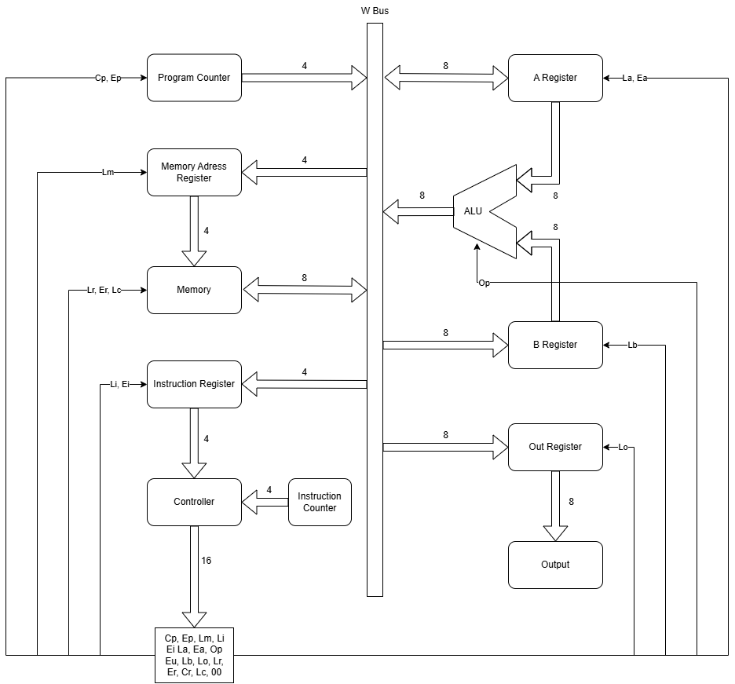
*Block diagram of the 8-bit processor architecture. This diagram shows the main components (bus, registers, ALU, control unit, RAM) and how they are interconnected. It helps visualize the data flow and control signals in the processor.*

## Architecture and Components

This 8-bit processor is designed according to the von Neumann architecture. It contains a simple bus, instruction register, ALU, control unit, and RAM. Everything is built from basic logic gates. The architecture is modular, making it easy to understand and expand for educational purposes.

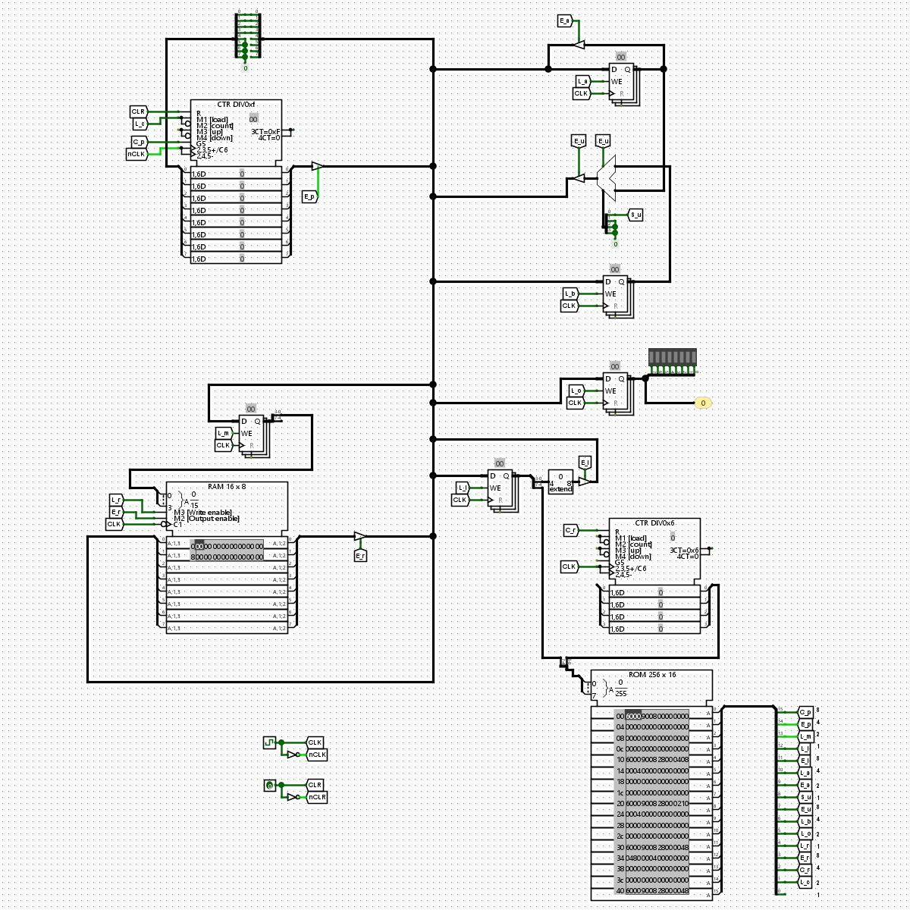
*Signal flow between Program Counter, Control Unit, and other components. This illustration shows how control signals like Cp, Ep, Le, and others coordinate the operation of the processor's modules.*

### Bus Scheme

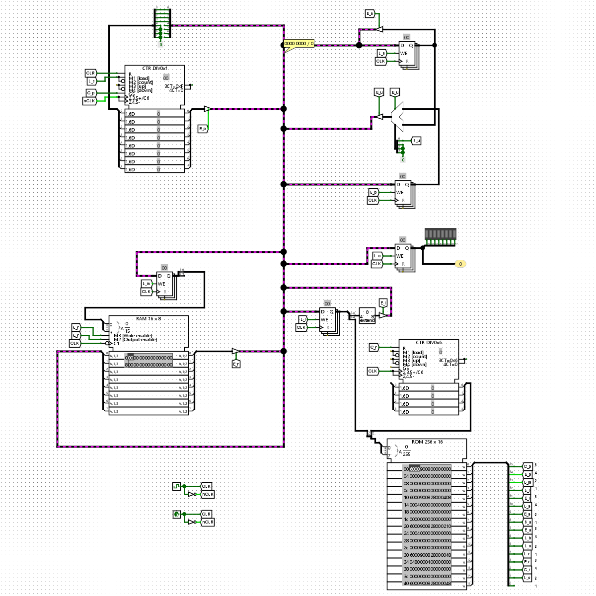
*W Bus interconnects all main components.*

- **8-bit W Bus**: The only data bus connecting all main components. The W Bus is central to the processor, allowing data transfer between registers, memory, and the ALU. All read and write operations use this bus.

### Program Counter Scheme

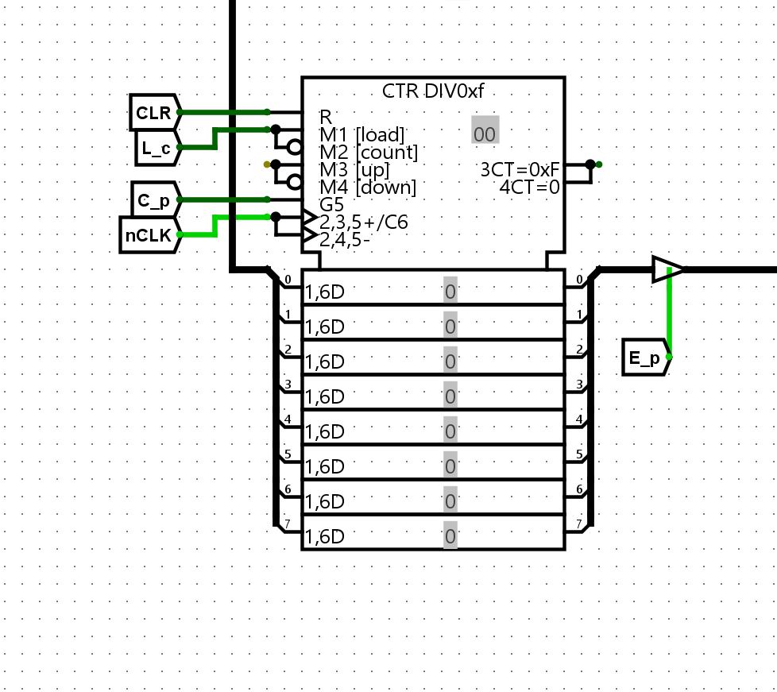
*4-bit Program Counter with increment, load, and output control.*

- **4-bit register**. The program counter keeps track of the address of the next instruction to execute.
- **Signals**:
  - `Cp`: increments by 1, advancing to the next instruction.
  - `Ep`: sends the current value to the W Bus, making it available to other components.
  - `Le`: loads a new value into the counter, used for jumps and branches.
  - `CLK`, `CLR`: clocking and resetting signals to synchronize and initialize the counter.

### Registers Scheme

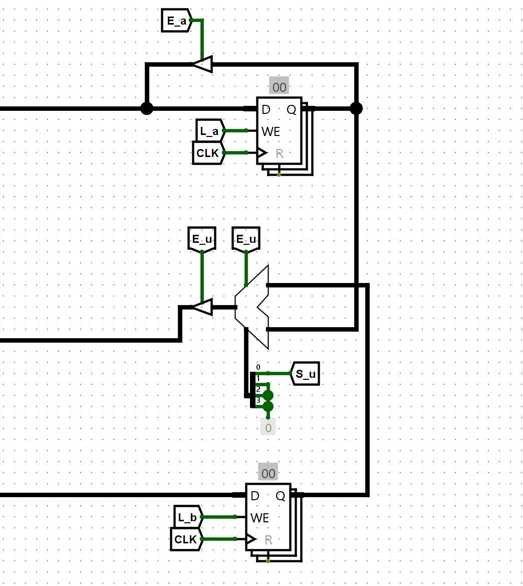
*General-purpose 8-bit registers A and B on top and bottom of the picture, alu in the middle.*

- **8-bit registers A and B**: These are general-purpose registers used for arithmetic and logic operations.
  - `Ea`: sends content of A to W Bus, allowing its value to be used elsewhere.
  - `La`: loads a value from W Bus into A.
  - `Lb`: loads a value from W Bus into B.

### ALU (Arithmetic Logic Unit) Scheme

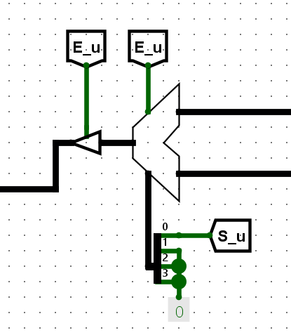
*ALU performing addition and subtraction. The diagram shows how operands are selected and results are placed on the bus.*

- Operations: addition, subtraction (8-bit). The ALU performs basic arithmetic and logic operations on data from the registers.
- Control: `Op` (0 = ADD, 1 = SUB), selects the operation.
- Output to bus: `Eu`, enables the ALU's output onto the W Bus.

### Output Register Scheme

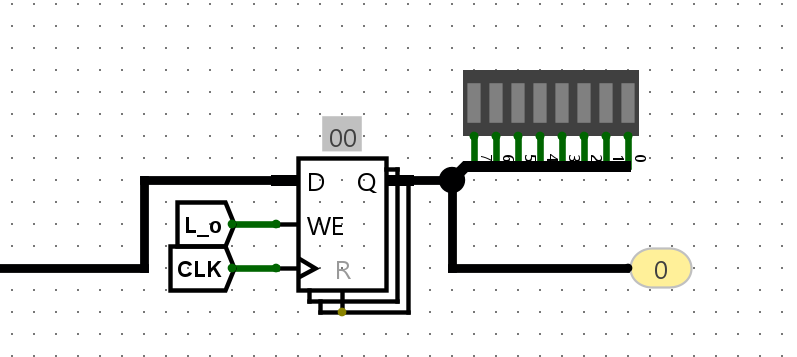
*8-bit output register for external data display.*

- **8-bit Out**: output register controlled by signal `Lo`. This register holds data to be sent to external devices or displayed as output.

### Address Register (MAR) Scheme

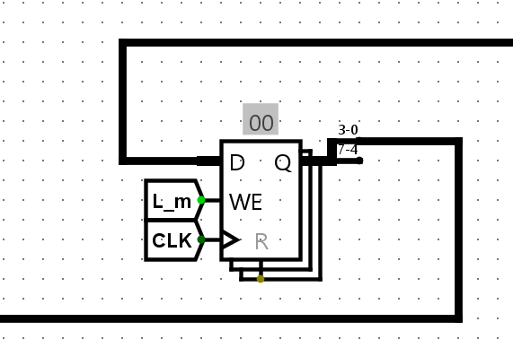
*4-bit Memory Address Register (MAR).*

- **4-bit**. The Memory Address Register (MAR) holds the address in RAM to be accessed.
- `Lm`: loads address from W Bus, allowing the processor to select which memory location to read or write.

### RAM Scheme

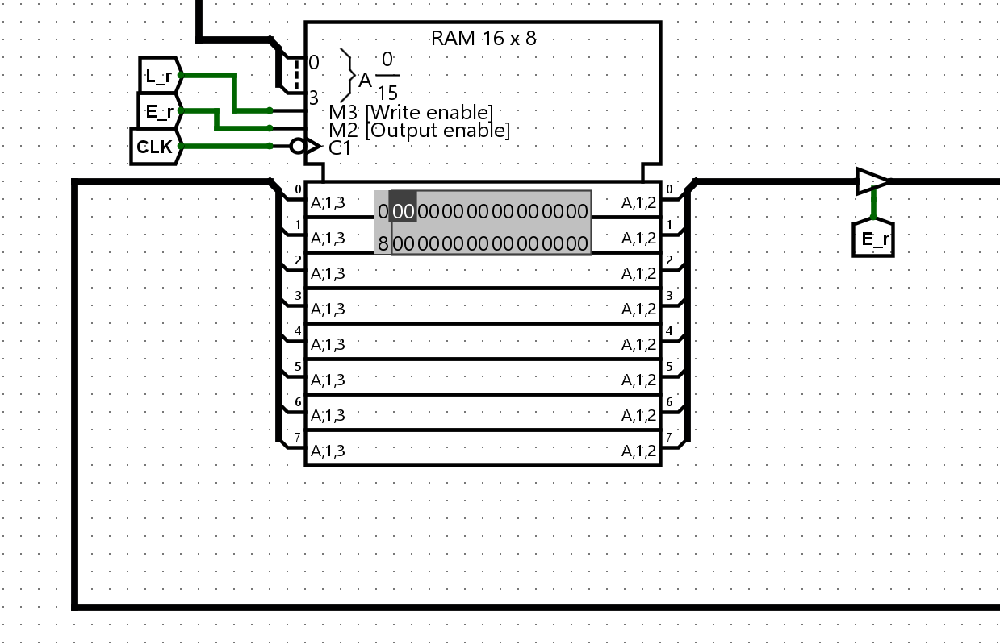
*Memory map of the 16×8-bit RAM. Each cell can be addressed and holds 8 bits of data.*

- **16×8-bit memory**. The RAM stores both program instructions and data.
- `Lr`: stores W Bus content at address given by MAR, enabling write operations.
- `Er`: reads data from the given address to W Bus, enabling read operations.

### Instruction Register (IR) Scheme

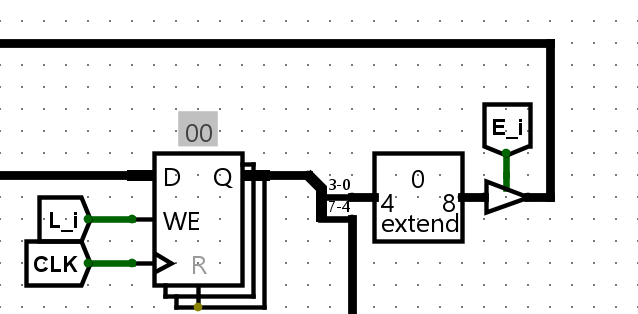
*8-bit Instruction Register (IR) for current instruction.*

- **8-bit**. The IR holds the current instruction being executed.
- `Li`: loads instruction from W Bus.
- Upper 4 bits → control unit, used to decode the operation.
- Lower 4 bits → W Bus, often used as an address or immediate value.

### Control Unit Scheme

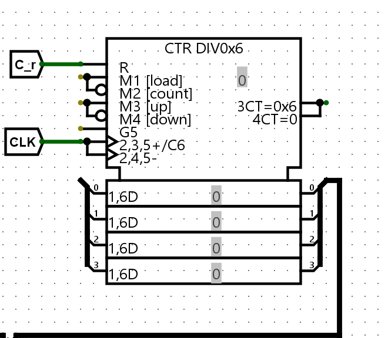
*4-bit counter in the control unit. Steps through instruction execution phases.*

- Generates signals for all components. The control unit orchestrates the operation of the processor by generating timing and control signals.
- Uses a **6-bit ring counter**, controlled by signals:
  - `Cr`: resets the counter (T1), starting a new instruction cycle.
  - `Lc`: direct load of value into PC, used for jumps and branches.

Control uint emits signal on 16 bit Control Buss in format: C = Cp, Ep, Lm, Li,  Ei, La, Ea, Op,  Eu, Lb, Lo, Lr,  Er, Cr, Lc, 00
Each signal is send to block of procesor, that he controls.

---

## **Instruction Set**

Mapping of binary/hex instructions to operations. This table shows how each instruction is encoded and what it does.

| Binary       | Hex  | Mnemonic   | Description                              |
|--------------|------|------------|------------------------------------------|
| `0000 xxxx`  | `0x00` | `NOP`    | No operation                             |
| `0001 xxxx`  | `0x10` | `LDA $h` | Load from address $h into register A     |
| `0010 xxxx`  | `0x20` | `STA $h` | Store register A into address $h         |
| `0011 xxxx`  | `0x30` | `ADD $h` | Add value at $h to register A            |
| `0100 xxxx`  | `0x40` | `SUB $h` | Subtract value at $h from register A     |
| `1101 xxxx`  | `0xD0` | `JMP $h` | Jump to address $h                       |
| `1110 xxxx`  | `0xE0` | `OUT`    | Output content of register A             |
| `1111 xxxx`  | `0xF0` | `HLT`    | Halt processor                           |

Unused codes (e.g., `0x50`–`0xC0`) are reserved and currently serve as `NOP`. This allows for future expansion or custom instructions.

---

## **Instruction Control – Clock Cycles**

The control unit has 6 internal steps (T1–T6), during which it sets active signals. Each instruction is broken down into these steps, ensuring precise timing and coordination of all processor components. This table helps clarify the micro-operations performed during each instruction cycle.

| Instruction  | T1                  | T2                         | T3                 | T4                 | T5                | T6         |
|-------------|---------------------|----------------------------|--------------------|--------------------|-------------------|------------|
| `LDA $h`     | `Ep, Lm`            | `Cp, Er, Li, Cr`           | `Lm, Ei`           | `Er, La`           | `Cr`              | —          |
| `STA $h`     | `Ep, Lm`            | `Cp, Er, Li, Cr`           | `Lm, Ei`           | `Ea, Lr`           | `Cr`              | —          |
| `ADD $h`     | `Ep, Lm`            | `Cp, Er, Li, Cr`           | `Lm, Ei`           | `Er, Lb`           | `Op, Eu, La`      | `Cr`       |
| `SUB $h`     | `Ep, Lm`            | `Cp, Er, Li, Cr`           | `Lm, Ei`           | `Er, Lb`           | `Op, Eu, La`      | `Cr`       |
| `JMP $h`     | `Ep, Lm`            | `Cp, Er, Li, Cr`           | `Lc, Ei`           | `Cr`               | —                 | —          |
| `OUT`        | `Ep, Lm`            | `Cp, Er, Li, Cr`           | `Ea, Lo`           | `Cr`               | —                 | —          |
| `HLT`        | `Cr`                | —                          | —                  | —                  | —                 | —          |

---

## Example Program: Fibonacci Sequence

This program demonstrates a simple Fibonacci sequence using the 8-bit computer's instruction set. It loads two numbers from memory, adds them, outputs the result, stores it back, and repeats the process in a loop.

| Address | Instruction | Comment                       |
|---------|-------------|-------------------------------|
| 0x00    | LDA 0x0E    | Load first number             |
| 0x01    | ADD 0x0F    | Add second number             |
| 0x02    | OUT         | Output the result             |
| 0x03    | STA 0x0E    | Store result as first number  |
| 0x04    | LDA 0x0F    | Load original second number   |
| 0x05    | ADD 0x0E    | Add new first number          |
| 0x06    | OUT         | Output the result             |
| 0x07    | STA 0x0F    | Store result as second number |
| 0x08    | JMP 0x00    | Repeat the cycle              |
| 0x09    | HLT         | Stops processor               |

This program also needs 2 memory cells for storing the current and previous Fibonacci numbers. These are initialized at addresses `0x0E` and `0x0F`:

- `0x0E`: Second number of the Fibonacci sequence (initial value: `0x01`)
- `0x0F`: First number of the Fibonacci sequence (initial value: `0x00`)

| Address | Instruction | Comment                             |
|---------|-------------|-------------------------------------|
| 0x0E    | 0x01        | Second number of Fibonacci sequence |
| 0x0F    | 0x00        | First number of Fibonacci sequence  |
